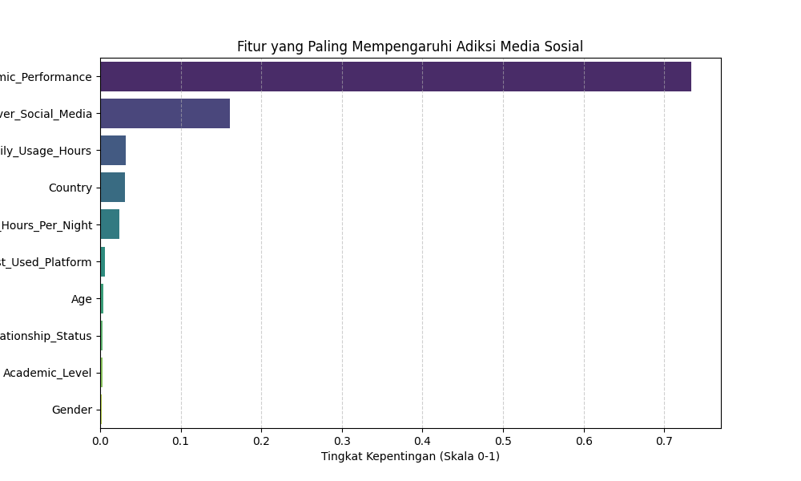

## 🚀 Hasil Analisis: The Scroll Effect

Setelah melakukan pengujian ketat, proyek ini berhasil membangun model prediksi dengan:
- **Akurasi (R-Squared):** 97.06%
- **Metode:** Random Forest Regressor (Ensemble Learning)
- **Insight Utama:** Model membuktikan bahwa **Dampak Akademik** dan **Konflik Sosial** adalah indikator adiksi yang jauh lebih kuat dibandingkan sekadar durasi penggunaan (jam).

### 📊 Visualisasi Utama

